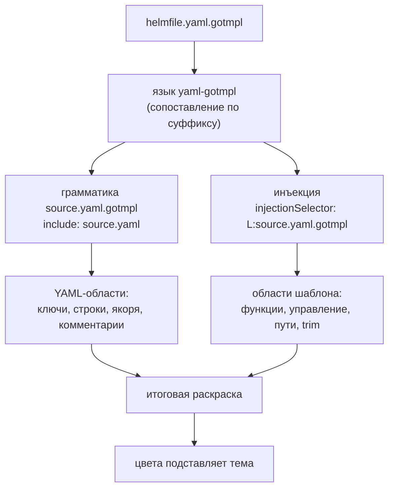

# Gotmpl YAML Highlighter - Plan

## Goal Capsule

- **Цель.** Расширение VS Code, которое подсвечивает `*.yaml.gotmpl` одновременно как YAML и как Go-шаблон, и даёт по шаблонным конструкциям hover, автодополнение и диагностику парности.
- **Кто решает по продукту.** Игорь Крамарь. Решения по цветовой модели, скоупу файлов, объёму справочника и языку подсказок приняты и зафиксированы в Key Decisions.
- **Открытые блокеры.** Публикация в VS Code Marketplace требует publisher-аккаунта Microsoft, которого пока нет. Блокирует только R13; разработка и локальная установка `.vsix` от него не зависят.
- **Что спланировано на этот срез.** U1-U6 покрывают R1-R4 и R12 — подсветку, изоляцию и редакторское поведение (влиты). U7-U10 покрывают R8 — справочник функций (влиты). U11-U14 покрывают R5-R7 — подсказки (влиты). U15-U17 покрывают R9-R11 — диагностику. Требования R13, R14 (поставка) остаются без юнитов до своей задачи.
- **Продуктовый контракт не менялся.** Requirements, Key Decisions и Acceptance Examples сохранены дословно, R-ID не переприсваивались.

---

## Product Contract

### Summary

Расширение VS Code для файлов `*.yaml.gotmpl`, которое сохраняет YAML-подсветку и накладывает поверх неё разбор Go-шаблона, различая функции helmfile, функции sprig, управляющие конструкции, пути и trim-маркеры. Сверх раскраски даёт hover по конструкциям и функциям, автодополнение и подчёркивание незакрытых конструкций. Публикуется в Marketplace, все тексты на английском.

### Problem Frame

Файл `helmfile.yaml.gotmpl` — два языка в одном: YAML снаружи, Go-шаблон во вставках `{{ … }}`. VS Code выбирает один язык на файл, и все существующие расширения решают этот выбор одинаково — объявляют `.gotmpl` отдельным языком со своим scope. Следствие не в том, что раскраска плохая, а в том, что YAML пропадает целиком: ключи, якоря, списки, комментарии перестают отличаться друг от друга. Обратный выбор — оставить файл языком `yaml` — даёт зеркальную потерю: для YAML-грамматики `{{ requiredEnv "IMAGE_TAG" }}` неотличимо от произвольной строки.

Наблюдаемое сегодня хуже обоих вариантов. Установленное расширение `karyan40024.gotmpl-syntax-highlighter@0.0.3` объявляет расширения файлов как `["gotmpl", ".tmpl", ".tpl"]` — первый элемент без ведущей точки, чего VS Code не сопоставляет. То есть на `helmfile.yaml.gotmpl` не срабатывает ни оно, ни YAML: файл открывается как `plaintext`. Даже сработай оно, его грамматика содержит десять областей на весь язык, и все имена функций попадают в одну — `variable.other.readwrite`, — поэтому `requiredEnv` и `readFile` неразличимы по цвету принципиально.

Цена — на каждом чтении файлов деплоя: эталонный `helmfile.yaml.gotmpl` содержит несколько релизов, вложенные структуры и десятки строк комментариев, и всё это читается одним цветом.

### Key Decisions

- KD1. **Инъекционная грамматика поверх YAML, а не замена языка.** Единственный механизм VS Code, который накладывает вторую грамматику на существующую, не вытесняя её. Governs R1.
- KD2. **Собственный языковой идентификатор, инъекция целится в его scope, а не в `source.yaml`.** Инъекция в `source.yaml` подсветила бы `{{ }}` во всех YAML-файлах пользователя, включая Ansible и GitHub Actions, где такие последовательности имеют другой смысл. Плата: `redhat.vscode-yaml` не обслуживает эти файлы, поэтому редакторское поведение YAML обеспечивается своей конфигурацией языка. Governs R4, R12.
- KD3. **Цвета берёт активная тема; расширение своей палитры не задаёт** (session-settled: user-directed — выбрано над вариантом со своей палитрой поверх темы: расширение должно выглядеть родным на любой теме). Следствие принято осознанно: густота многоцветности становится свойством темы, а связывание парных `if`/`end` цветом и разбор пути по сегментам становятся недостижимы — грамматика TextMate не строит дерева. Governs R2, R3.
- KD4. **Языковые возможности — провайдеры в процессе расширения, без отдельного LSP-сервера.** Hover, автодополнение и диагностика для одного языка в одном редакторе не окупают процессной границы. Теряется переносимость на Neovim и другие LSP-клиенты. Governs R5, R6, R7, R9, R10.
- KD5. **Справочник функций генерируется скриптом из документации, а не набивается руками** (session-settled: user-directed — выбрано над ходовым подмножеством: полнота при неизменной ручной работе). Ручная набивка двухсот функций устарела бы к первому релизу sprig. Governs R8.
- KD6. **Все тексты расширения на английском** (session-settled: user-directed — выбрано над двуязычным переключателем: расширение публикуется в Marketplace). Governs R8.
- KD7. **Скоуп ограничен `*.yaml.gotmpl`** (session-settled: user-directed — выбрано над любыми `.gotmpl`: в рабочих проектах файлы только этой формы). Ограничение вдобавок обходит известный потолок механизма: инъекция не каскадится внутрь уже встроенного языка, поэтому диспетчеризация базовой грамматики по вложенному расширению потребовала бы другого решения. Governs R4.

### Как устроена раскраска

Инъекция целится в собственный scope, а не в `source.yaml` — поэтому шаблонные области появляются во всех местах файла, включая внутренности YAML-строк, но не появляются в чужих YAML-файлах.

### Requirements

**Подсветка**

- R1. Файл `*.yaml.gotmpl` подсвечивается одновременно как YAML и как Go-шаблон: YAML-области (ключи, строки, числа, якоря, комментарии, маркеры списков и блочных скаляров) сохраняются, шаблонные вставки получают собственные области.
- R2. Грамматика различает отдельными областями: ограничители `{{` и `}}`, trim-маркеры `{{-` и `-}}`, управляющие конструкции (`if`, `else`, `else if`, `range`, `with`, `end`, `define`, `template`, `block`), функции helmfile, функции sprig, строковые литералы, числа, `true`/`false`/`nil`, переменные вида `$name`, пути вида `.Values.foo`, оператор конвейера `|`, оператор присваивания `:=`, комментарии шаблона `{{/* … */}}`.
- R3. Расширение не задаёт цвета: раскраску областей выполняет активная тема пользователя.
- R4. Подсветка шаблона применяется только к файлам с суффиксом `.yaml.gotmpl`; открытый рядом обычный `.yaml` не меняет вида, включая файлы с последовательностями `{{ }}` и `${{ }}`.

**Подсказки**

- R5. Наведение на управляющую конструкцию показывает описание того, что она делает, и пример применения.
- R6. Наведение на имя функции показывает её сигнатуру, описание и пример.
- R7. Автодополнение внутри `{{ }}` предлагает имена функций и сниппеты парных конструкций (`if`…`end`, `range`…`end`, `with`…`end`) с описанием в списке.
- R8. Справочник покрывает все функции sprig и все функции helmfile, тексты на английском, содержимое порождается скриптом из внешней документации и хранится в репозитории как сгенерированный артефакт.

**Диагностика**

- R9. Незакрытая вставка (`{{` без `}}`) подчёркивается как ошибка с указанием позиции открытия.
- R10. Непарные конструкции подчёркиваются как ошибка: открывающая без `end`, лишний `end`, `else` вне `if`/`with`.
- R11. На корректном файле диагностика молчит: проверяется на эталонном `helmfile.yaml.gotmpl` и на тестовом корпусе, включающем `{{` внутри YAML-строк, внутри комментариев YAML и внутри блочных скаляров.

**Редакторское поведение**

- R12. Комментирование строки, автоотступ, свёртка по отступам и подсветка парных скобок работают в этих файлах так же, как в YAML.

**Поставка**

- R13. Расширение опубликовано в VS Code Marketplace и устанавливается поиском по названию.
- R14. README показывает снимок экрана «до и после» на реальном фрагменте helmfile и перечисляет, что расширение делает и чего не делает.

### Acceptance Examples

- AE1. **Covers R1, R2.** **Given** открыт эталонный `helmfile.yaml.gotmpl`. **When** пользователь смотрит на строку `username: {{ requiredEnv "HelmRegistryUsername" }}`. **Then** `username` окрашен как YAML-ключ, `requiredEnv` — как функция helmfile, строка в кавычках — как строка, `{{` и `}}` — как ограничители, и все четыре цвета различны.
- AE2. **Covers R4.** **Given** в редакторе открыты `helmfile.yaml.gotmpl` и `.github/workflows/ci.yaml`, содержащий `${{ github.sha }}`. **When** пользователь переключается между вкладками. **Then** в первом файле шаблонные области подсвечены, во втором вид не отличается от вида без установленного расширения.
- AE3. **Covers R10.** **Given** файл содержит `{{ if .Values.debug }}` без соответствующего `{{ end }}`. **When** файл открыт или изменён. **Then** конструкция `if` подчёркнута как ошибка с сообщением о недостающем `end`, а прочие конструкции файла не подчёркнуты.
- AE4. **Covers R11.** **Given** файл содержит YAML-строку `description: "используйте {{ для вставки"` и комментарий `# {{ end }} в комментарии`. **When** файл открыт. **Then** диагностика не выдаёт ошибок ни по одной из этих строк.
- AE5. **Covers R6.** **Given** курсор наведён на `indent` в выражении `{{ readFile "x.conf" | indent 16 }}`. **When** появляется всплывающая подсказка. **Then** она содержит сигнатуру функции, описание и пример, и относится к `indent`, а не к `readFile`.

### Scope Boundaries

- Шаблоны поверх не-YAML: `.json.gotmpl`, `.conf.gotmpl`, `.tpl`, `.tmpl` — вне скоупа.
- Шаблоны Helm-чартов (`templates/*.yaml` без суффикса `.gotmpl`) — вне скоупа: они опознаются не расширением, а положением в чарте, и требуют другой эвристики.
- Форматирование файла и выполнение шаблона (подстановка значений, предпросмотр результата) — вне скоупа: расширение только читает.
- Разрешение путей `.Values.*` по фактическому `values.yaml` — вне скоупа; этим занимается `tim-koehler.helm-intellisense` для чартов.
- Собственная цветовая тема в комплекте — вне скоупа по KD3.

### Dependencies / Assumptions

- Публикация в Marketplace требует publisher-аккаунта Microsoft — его получение вне контроля разработки.
- Предполагается, что инъекция с селектором на собственный scope применяется внутри правил включённой грамматики YAML. Риск выше, чем кажется: встроенная грамматика YAML сама подключает `source.yaml.1.2` через `include`, то есть попадает ровно в тот случай, про который известное ограничение и написано. Предположение проверяется первым же юнитом реализации. Провал на верхнем уровне обрушивает подход целиком и означает остановку с докладом; провал только внутри YAML-строк и блочных скаляров — не остановка, а граница возможностей, которая фиксируется в README. Переход на инъекцию в `source.yaml` обходным путём не является: он нарушает R4.
- Предполагается, что документация sprig пригодна к машинному разбору со стабильной структурой. Если структура непригодна, генератор берёт исходники sprig вместо документации; на R8 это не влияет.
- Эталонный `helmfile.yaml.gotmpl` содержит только `requiredEnv` и `readFile | indent` — ни одной управляющей конструкции. Для проверки R2, R9, R10, R11 нужен отдельный тестовый корпус, эталонного файла недостаточно.

### Outstanding Questions

**Resolve Before Planning**

- Publisher-аккаунт Microsoft для публикации: есть ли он, кто его заводит. Блокирует R13, не блокирует остальное.

**Deferred to Planning**

- Источник описаний функций sprig: документация проекта против исходников с комментариями.
- Форма хранения справочника и способ его обновления при выходе новой версии sprig.

### Sources / Research

- Эталонный `helmfile.yaml.gotmpl` из рабочего проекта — 272 строки, пять шаблонных вставок, обширные комментарии. В репозиторий расширения не входит; тестовый корпус пишется отдельно.
- Установленное окружение: `karyan40024.gotmpl-syntax-highlighter@0.0.3`, `redhat.vscode-yaml@1.24.0`, `tim-koehler.helm-intellisense@0.15.0`, активная тема `enkia.tokyo-night@1.1.2`.
- Ограничение механизма инъекций: инъекция не применяется внутрь уже встроенного языка и не каскадится в другую инъекцию (microsoft/vscode-textmate, issues #122 и #152). Определяет границу скоупа по KD7 и одновременно является главным техническим риском подхода — см. Assumptions.
- Устройство встроенной грамматики YAML (проверено на VS Code 1.134.0): `source.yaml` — тонкий диспетчер, включающий `source.yaml.1.2` по умолчанию и `source.yaml.embedded` для встраивания; версии 1.0, 1.1 и 1.3 лежат отдельными файлами. Происхождение — RedCMD/YAML-Syntax-Highlighter, лицензия MIT.
- Существующие расширения того же назначения: `romantomjak/vscode-go-template`, `jinliming2/vscode-go-template`, `mortenson/go-template-transpiler-extension` — все объявляют отдельный язык, ни одно не сохраняет базовую грамматику.

---

## Planning Contract

### Key Technical Decisions

- KTD1. **Проба механизма отдельным ранним юнитом, до написания полной грамматики.** Подход целиком стоит на предположении, которое ни документацией, ни чужим опытом не подтверждено: применяется ли инъекция с селектором на корневой scope внутри правил грамматики, подключённой через `include`. Известное ограничение библиотеки прямо про это (microsoft/vscode-textmate #122, #152). Узнать ответ надо ценой одной минимальной грамматики, а не полной. Governs R1, R4. Реализует KD2.
- KTD2. **Проверка токенизации прогоняется вне редактора через `vscode-textmate` + `vscode-oniguruma`.** Это тот же движок, что и в редакторе, поэтому расхождения между тестом и реальностью не будет. Альтернатива — открывать файл руками и смотреть глазами — не даёт регрессии и не переживает правку грамматики. Governs R2.
- KTD3. **YAML-грамматика для тестов копируется скриптом из локальной установки VS Code, а не вендорится в репозиторий.** Встроенная грамматика — цепочка из шести файлов (`source.yaml` — тонкий диспетчер, включающий `source.yaml.1.2` по умолчанию и `source.yaml.embedded` для встраивания), она версионируется вместе с редактором и обновляется без нас. Копия в репозитории протухла бы молча. Лицензия источника (RedCMD/YAML-Syntax-Highlighter) — MIT, то есть вендоринг допустим и остаётся запасным путём, если копирование окажется ненадёжным на чужой машине.
- KTD4. **Инъекция описывается отдельным файлом грамматики, а не встраивается в основную.** Разделение повторяет то, как это устроено в самом VS Code, и оставляет основную грамматику тривиальной: одна строка `include`. Отладка тоже проще — видно, какой из двух слоёв дал область.
- KTD6. **Справочник хранится одним сгенерированным JSON, а не набором файлов по темам.** Тематическое деление есть в источнике и нужно там, где документацию читают люди; потребителю справочника (провайдеры подсказок) нужен поиск по имени. Одна карта имя → запись избавляет от склейки при каждом обращении. Governs R8. Реализует KD5.
- KTD7. **Поле образца вызова называется `usage`, а не `signature`.** Сигнатур в документации sprig нет ни в каком виде — есть примеры вызова. Назвать извлечённую из примера строку сигнатурой значило бы обещать типы и арность, которых в данных нет. `usage` обещает ровно то, что даёт: как эту функцию вызывают.
- KTD8. **Разбор проверяется офлайн на зафиксированных образцах, актуальность данных — только при запуске генератора.** Тесты в сеть не ходят: источник меняется без нас, и прогон, зависящий от чужого репозитория, краснел бы от чужих правок. Образцы — настоящие фрагменты обеих документаций, закоммиченные в репозиторий. Граница проходит так: тест отвечает «разбор понимает эту форму», генератор отвечает «данные соответствуют источнику сегодня». Governs R8.
- KTD9. **Полнота проверяется двумя независимыми путями к одному числу.** Тест считает функции в образцах своим способом — прямым подсчётом заголовков — и сравнивает с числом записей в справочнике, порождённых разбором. Сверка справочника с самим собой была бы зелёной всегда, включая сломанный генератор; разбор класса — `stend-podtverzhdaet-sobstvennuyu-nastrojku` в базе знаний. Governs R8.
- KTD10. **Логика «что под курсором» — чистая функция от текста строки и позиции; провайдер только переводит её результат в объекты API редактора.** Модуль `vscode` существует лишь внутри запущенного редактора, а весь проект проверяется вне его. Граница проходит так: разбор строки проверяется обычным прогоном на сотнях случаев, а непроверенными остаются регистрация провайдеров и сборка объектов `Hover`/`CompletionItem` — там нет ветвлений, только вызовы API. Это третье применение той же формы: загрузка отделена от разбора, грамматика проверяется движком редактора вне редактора. Governs R5, R6, R7. Реализует KD4.
- KTD11. **Код расширения — CommonJS; проверки остаются ES-модулями.** VS Code загружает точку входа расширения только как CommonJS: ESM в расширениях не поддерживается, и все установленные на машине расширения тому подтверждение. Обходной путь через `.cjs`-обёртку с динамическим импортом добавил бы асинхронность в активацию без выгоды. ES-модуль импортирует CommonJS нативно, включая именованные импорты, поэтому существующие проверки работают с новым кодом без переходников.
- KTD12. **JS с JSDoc и проверкой типов через `tsc --checkJs --noEmit`, а не TypeScript.** План GTM-1 обещал TypeScript в этой задаче; обещание пересмотрено. Причина: TypeScript вносит шаг сборки в `out/`, который надо не забыть перед каждой упаковкой и который тихо разъезжается с тем, что реально попало в пакет. `@types/vscode` даёт те же типы через JSDoc, а проверка идёт без порождения файлов — упаковывается ровно то, что написано.
- KTD13. **Незакрытая вставка сообщается вне YAML-строк безусловно, внутри строк — только когда содержимое похоже на выражение шаблона.** Здесь замкнутый круг: отличить текст `"используйте {{ для вставки"` от незакрытой вставки внутри кавычек нечем, кроме наличия закрывающей пары, а её отсутствие и есть проверяемое условие. Разрывается признаком: после `{{` внутри строки должно идти ключевое слово, известная функция, путь или переменная. Отказ от проверки внутри строк целиком был бы проще, но пропускал бы настоящие ошибки там, где вставки в строках — обычное дело у helmfile. **Цена названа честно:** текст вида `"{{ if"` внутри YAML-строки даст ложное срабатывание. Это редкая строка, и цена принята сознательно, потому что обратная ошибка — молчание на реальной незакрытой вставке — дороже. Governs R9, R11.
- KTD14. **Разбор документа — чистая функция от полного текста, возвращающая список находок с позициями.** Продолжение KTD10: провайдер переводит находки в объекты API и ничего не решает. Существующий `actionSpans` работает построчно и остаётся как есть — парность требует обхода всего текста со стеком открытых конструкций, и это отдельная функция, а не расширение прежней. Governs R9, R10, R11.
- KTD15. **Незакрытая конструкция подчёркивается и во время набора; отдельного поведения для незавершённого ввода нет.** Пользователь, напечатавший `{{ if .x }}` и не дошедший до `end`, увидит подчёркивание — и оно исчезнет, как только он допишет. Это обычное поведение проверок в редакторе, а попытка угадать «он ещё печатает» требует эвристики по времени и положению курсора, которая ошибается в обе стороны. Governs R10.
- KTD5. **Регистрация языка через `filenamePatterns`, а не `extensions`.** VS Code сопоставляет `extensions` по последнему суффиксу, поэтому `.gotmpl` захватил бы и `.json.gotmpl`, и `.conf.gotmpl` — прямое нарушение KD7. Шаблон `*.yaml.gotmpl` выражает границу скоупа буквально. Governs R4. Реализует KD7.

### Assumptions

- Инъекция с селектором `L:source.yaml.gotmpl` применяется внутри правил включённой грамматики YAML. Это предположение, а не факт; U2 его проверяет и является гейтом для остальных юнитов.
- Локальная установка VS Code присутствует на машине разработчика и содержит встроенную грамматику YAML. Проверено на этой машине: VS Code 1.134.0, `/usr/share/code/resources/app/extensions/yaml/syntaxes/`. На других платформах путь другой — скрипт ищет по нескольким известным местам и внятно падает, если не нашёл.
- `redhat.vscode-yaml` регистрирует ту же область `source.yaml`, что и встроенная грамматика. На собственный scope расширения это не влияет, но при отладке различие важно помнить.
- **Требование «каждая запись несёт сигнатуру» источником не обеспечено.** В документации sprig сигнатур нет — есть примеры вызова. Запись несёт `usage`, извлечённый из примера, и это меньше, чем сигнатура: арность и типы из него не следуют. Требование R8 выполняется по существу (пользователь видит, как вызывать функцию), но не буквально.
- **Требование «каждая запись несёт пример» источником обеспечено не полностью.** Примера нет у 46 функций sprig из 209, среди них: `genPrivateKey`, `now`, `first`, `mustFirst`, `rest`, `mustRest`, `last`, `mustLast`, `initial`, `mustInitial`, `slice`, `mustSlice`, `add1`, `sub`, `div`, `mod`, `min`, `floor`, `ceil`, `round`, `add1f`, `semverCompare`, `sortAlpha`, `untitle`, `quote`, `squote`, а также функции страниц `encoding` и `paths`, документированные списком. Это настоящие функции, а не мусор разбора. Пример остаётся необязательным полем; число записей без примера печатается генератором и закреплено тестом, чтобы молчаливый рост этого числа был заметен.
- Описание, в отличие от примера, есть у всех функций sprig. Запись без описания — признак поломки разбора, а не свойство источника, поэтому по ней прогон падает.

### Sequencing

Срез GTM-3: U11 → U12 → U13, U14 параллельно любому из них. U11 несёт весь риск: если разбор позиции ошибается, ошибаются оба провайдера.

Срез GTM-1: U1 → **U2 (гейт)** → U3 → U4 → U5 → U6. U2 останавливает всё остальное: пока механизм не подтверждён, писать полную грамматику незачем. U5 может начинаться параллельно U3, но завершается после него.

---

## Implementation Units

### U1. Скелет расширения

- **Goal.** Собираемое и устанавливаемое расширение VS Code без единой языковой возможности — точка, от которой можно проверять всё остальное.
- **Requirements.** Предпосылка для R1-R4, R12.
- **Dependencies.** Нет.
- **Files.** `package.json`, `tsconfig.json`, `.vscodeignore`, `eslint.config.mjs`, `src/extension.ts`.
- **Approach.**
  1. `package.json` с полями издателя, `engines.vscode`, категориями и пустым `contributes`. Тексты английские.
  2. TypeScript со сборкой в `out/`, точка входа `src/extension.ts` с пустыми `activate`/`deactivate`.
  3. Линт минимальной конфигурацией, без правил «на будущее».
  4. `.vscodeignore` исключает исходники, тесты и `docs/` из пакета.
- **Patterns to follow.** Стандартный скелет расширения VS Code; никаких зависимостей сверх `@types/vscode`, `typescript`, `eslint`.
- **Test scenarios.** `Test expectation: none` — юнит не несёт поведения: только сборка и упаковка. Проверка выражена в Verification ниже.
- **Verification.** Сборка проходит без ошибок; линт чистый; `npx @vscode/vsce package` выдаёт `.vsix`. Аккаунт издателя для упаковки не нужен — достаточно заполненного поля `publisher`; аккаунт требуется только для публикации (R13, другая задача).

### U2. Проба механизма инъекции — гейт

- **Goal.** Ответить фактом, а не рассуждением, на вопрос: применяется ли инъекция с селектором на корневой scope внутри правил включённой грамматики YAML, и в каких именно контекстах.
- **Requirements.** Governs R1, R4; проверяет KD2, KTD1.
- **Dependencies.** U1.
- **Files.** `syntaxes/yaml-gotmpl.tmLanguage.json`, `syntaxes/gotmpl-injection.tmLanguage.json`, `scripts/fetch-yaml-grammar.mjs`, `test/tokenize.mjs`, `test/fixtures/probe.yaml.gotmpl`.
- **Approach.**
  1. Скрипт `fetch-yaml-grammar.mjs` ищет каталог встроенных грамматик YAML в известных местах установки VS Code (`/usr/share/code/resources/app/extensions/yaml/syntaxes`, `/usr/lib/code/...`, пути macOS и Windows) и копирует всю цепочку в игнорируемый git каталог. Не нашёл — внятная ошибка с перечислением проверенных путей, а не молчаливый пропуск.
  2. Основная грамматика: `scopeName: source.yaml.gotmpl`, `patterns: [{"include": "source.yaml"}]` — больше ничего.
  3. Инъекционная грамматика: минимальная, одно правило на `{{ … }}` с областью `punctuation.section.embedded`, `injectionSelector: "L:source.yaml.gotmpl"`.
  4. `test/tokenize.mjs` собирает `Registry` из `vscode-textmate` с `onigLib` из `vscode-oniguruma`, отдаёт грамматики через `loadGrammar` и — существенно — объявляет инъекцию через `getInjections(scopeName)`: именно так редактор подключает инъекции, и без этого проба проверила бы не то.
  5. Пробный образец содержит три контекста: `{{ }}` в значении ключа на верхнем уровне; `{{ }}` внутри строки в двойных кавычках; `{{ }}` внутри блочного скаляра `|`.
- **Execution note.** Начать с пробы, а не со скелета грамматики: цель юнита — знание, а не код. Результат по каждому из трёх контекстов зафиксировать письменно.
- **Test scenarios.**
  1. Токенизация пробного образца завершается без исключения и возвращает непустой список токенов.
  2. `{{ requiredEnv "X" }}` в значении ключа верхнего уровня несёт область инъекции.
  3. То же внутри строки в двойных кавычках — фиксируется результат, каким бы он ни был.
  4. То же внутри блочного скаляра `|` — фиксируется результат.
  5. YAML-области (`entity.name.tag` на ключе) присутствуют одновременно с областями инъекции — то есть включение `source.yaml` работает.
- **Verification.** Написан отчёт: подсвечивается / не подсвечивается по каждому из трёх контекстов, с той же градацией, что в Assumptions продуктового контракта. **Гейт: провал в контексте 1 (верхний уровень) — остановиться и доложить.** Провал только в контекстах 2 и 3 — граница возможностей: фиксируется, попадает в README, работа продолжается. Переключение инъекции на `source.yaml` запрещено при любом исходе — оно нарушит R4.

### U3. Полная грамматика Go-шаблона

- **Goal.** Инъекционная грамматика различает все сущности, перечисленные в R2, общепринятыми областями TextMate.
- **Requirements.** Covers R2, R3.
- **Dependencies.** U2 (гейт пройден).
- **Files.** `syntaxes/gotmpl-injection.tmLanguage.json`, `test/fixtures/constructs.yaml.gotmpl`.
- **Approach.**
  1. Внешнее правило: от `{{` или `{{-` до `}}` или `-}}`, область `meta.embedded.block.gotmpl`, ограничители — `punctuation.section.embedded`.
  2. Внутри: комментарий шаблона `{{/* … */}}` отдельным правилом раньше остальных, иначе его содержимое разберётся как код.
  3. Управляющие слова — `keyword.control`; функции helmfile — `support.function` (перечислимый список); функции sprig — `entity.name.function` (сопоставление по форме идентификатора, а не по списку: полный перечень появится в GTM-2 и здесь не нужен).
  4. Строки — `string.quoted.double` и `string.quoted.single`; числа — `constant.numeric`; `true`/`false`/`nil` — `constant.language`; `$name` — `variable.other`; пути `.Foo.Bar` — `variable.other.member`; `|` и `:=` — `keyword.operator`.
  5. Различение helmfile и sprig по списку имён — единственное место, где грамматика знает предметную область; список держать в одном месте файла и коротко это отметить. Правило helmfile обязано стоять раньше правила sprig: sprig сопоставляется по форме идентификатора и иначе поглотит `requiredEnv` первым.
- **Patterns to follow.** Имена областей брать ровно те, что темы действительно красят: сверяться с тем, какие правила есть в теме Tokyo Night, а не изобретать `*.gotmpl`-суффиксы, на которые не подписана ни одна тема.
- **Test scenarios.**
  1. Каждая сущность из R2 встречается в образце хотя бы раз и получает ожидаемую область — по позиции, а не по факту наличия где-то в файле.
  2. `{{- if … }}` — trim-маркер отделён от ключевого слова и несёт свою область.
  3. `{{/* комментарий с {{ внутри */}}` целиком является комментарием; вложенная последовательность не открывает новую вставку.
  4. `{{ readFile "x" | indent 16 }}` — `readFile` как функция helmfile, `indent` как функция sprig, `|` как оператор, `16` как число, строка как строка: пять разных областей в одном выражении.
  5. Отсутствие области `*.gotmpl`-суффикса там, где тема её не покрасит: проверяется, что использованы общепринятые имена.
- **Verification.** Все сценарии проходят; ни одно правило не задаёт цвет (R3 — в расширении нет `configurationDefaults` с цветами и нет темы).

### U4. Конфигурация языка

- **Goal.** Редакторское поведение в этих файлах не хуже, чем в YAML.
- **Requirements.** Covers R12.
- **Dependencies.** U1.
- **Files.** `language-configuration.json`, `package.json`.
- **Approach.** Взять за образец конфигурацию языка встроенного YAML-расширения: комментарии `#`, пары скобок, автозакрытие кавычек, правила отступа, свёртка по отступам. Отличия от образца — только если они обоснованы шаблонными вставками.
- **Test scenarios.** `Test expectation: none` — поведение обеспечивается декларацией и проверяется вручную в редакторе; программной проверки конфигурации языка вне редактора не существует.
- **Verification.** В открытом `.yaml.gotmpl`: комментирование строки даёт `#`; Enter после ключа с двоеточием увеличивает отступ; блоки сворачиваются; парная скобка подсвечивается.

### U5. Тестовый корпус и проверка токенизации

- **Goal.** Регрессия, которая падает при поломке грамматики, а не просто существует.
- **Requirements.** Covers R2, R11 (в части «диагностика молчит» — здесь проверяется корректность разбора, сама диагностика придёт в GTM-4).
- **Dependencies.** U2; завершается после U3.
- **Files.** `test/tokenize.mjs`, `test/grammar.test.mjs`, `test/fixtures/*.yaml.gotmpl`.
- **Approach.**
  1. Вынести из `test/tokenize.mjs` пригодный к переиспользованию помощник: «дай области в позиции (строка, столбец)».
  2. Корпус: конструкции (U3), вставки внутри строк в кавычках, вставки внутри блочных скаляров `|` и `>`, `{{` внутри комментария YAML, вложенные `if`/`range`, файл без единой вставки (чистый YAML).
  3. Утверждения писать по смыслу — «в этой позиции есть область функции», — а не сверкой полного списка областей: последнее ломается от любой правки грамматики и обесценивает тест.
  4. Прогон одной командой, встроенной в `package.json`.
- **Test scenarios.**
  1. Файл без вставок токенизируется как обычный YAML; областей инъекции нет ни в одной позиции.
  2. `{{` внутри комментария YAML не открывает вставку.
  3. Вложенные `if` внутри `range` — оба ключевых слова получают область управления.
  4. Блочный скаляр `>` ведёт себя так же, как `|` (результат фиксируется по итогам U2).
  5. Прогон падает, если из грамматики убрать любое правило R2 — проверяется мутацией на одном правиле, чтобы убедиться, что тест вообще способен упасть.
- **Verification.** Одна команда прогоняет весь корпус; мутация правила роняет прогон.

### U6. Изоляция от чужих YAML

- **Goal.** Доказать R4: расширение не трогает обычные YAML-файлы.
- **Requirements.** Covers R4.
- **Dependencies.** U3.
- **Files.** `test/fixtures/plain.yaml`, `test/fixtures/workflow.yaml`, `test/grammar.test.mjs`.
- **Approach.** Токенизировать образцы грамматикой `source.yaml` (без нашей основной), при том же реестре, где инъекция объявлена. Если инъекция протекает, области шаблона появятся и там — тест это увидит. Образцы: обычный YAML с `{{ }}` в стиле Ansible и файл GitHub Actions с `${{ }}`.

  Существенная ловушка: `getInjections` в тестовой проводке обязан возвращать инъекцию **для любого запрошенного scope**, отдавая отсев селектору самой библиотеки. Если проводка не вернёт инъекцию для `source.yaml`, тест пройдёт, ничего не проверив, — он подтвердит собственную настройку вместо поведения редактора.
- **Test scenarios.**
  1. `{{ ansible_var }}` в файле, токенизированном как `source.yaml`, не получает ни одной области инъекции.
  2. `${{ github.sha }}` — то же самое.
  3. Тот же текст в файле `.yaml.gotmpl` области инъекции получает — то есть тест различает изоляцию и неработающую грамматику.
- **Verification.** Все три сценария проходят. Третий обязателен: без него первые два проходили бы и на сломанной грамматике.

### U7. Генератор справочника

- **Goal.** Один скрипт, порождающий справочник функций из обеих документаций без ручной правки результата.
- **Requirements.** Covers R8. Реализует KD5, KD6; следует KTD6, KTD7.
- **Dependencies.** Нет (независим от U1-U6).
- **Files.** `scripts/build-function-reference.mjs`, `data/functions.json`.
- **Approach.**
  1. Загрузка: 20 тематических файлов документации sprig и один файл helmfile.
  2. Разбор sprig: **три формы документирования, а не одна.** Заголовок второго или третьего уровня несёт одну или несколько функций — через запятую либо через ` and `; имя функции опознаётся как идентификатор со строчной первой буквы, чем и отсекаются прозаические разделы. Описание — текст до первого фенсированного блока, пример — сам блок. Сверх заголовков разбираются: списочная форма `` - `a`/`b`: описание `` (страница `encoding` документирует функции только так) и страница про одну функцию, называющая её лишь внутри блока (`uuid`). Разбор только по заголовкам второго уровня терял 34 функции, включая ходовые `b64enc`, `base`, `dir`, `uuidv4`, — и терял молча, потому что страница просто давала ноль записей.
  3. Разбор helmfile: другая форма — заголовок четвёртого уровня с именем в обратных кавычках. Отдельная функция разбора, а не флаг у общей: формы не родственны, и попытка выразить обе одним кодом даст правило, читаемое хуже двух.
  4. Слияние: у каждой записи поле источника. Функции, описанные в обоих (`env`, `get`), берутся из helmfile — в этих файлах действует его определение. Приоритет выражен явным правилом над полем источника, а не порядком слияния.
  5. `usage` извлекается из первой строки примера, когда она начинается с имени функции; иначе отсутствует.
  6. Отчёт в конце прогона: сколько функций всего, сколько по каждому источнику, сколько без примера, сколько без `usage`. Отчёт — не украшение: он единственное место, где видно, что источник изменился.
  7. Загрузка и разбор разделены: разбор принимает текст, а не адрес. Иначе U8 не сможет вызвать его без сети, и офлайн-проверка потребует переделки скрипта вместо его использования.
- **Execution note.** Начать с разбора одного тематического файла и убедиться на нём, что форма понята, — до загрузки всех двадцати.
- **Test scenarios.** Проверки живут в U8; здесь — сам генератор.
- **Verification.** Одна команда порождает `data/functions.json`; отчёт печатает 209 функций sprig и 19 helmfile; запись без описания отсутствует.

### U8. Образцы документации и офлайн-проверка разбора

- **Goal.** Разбор проверяется без сети, на зафиксированных фрагментах обеих документаций.
- **Requirements.** Covers R8. Следует KTD8.
- **Dependencies.** U7.
- **Files.** `test/fixtures/docs/sprig-*.md`, `test/fixtures/docs/helmfile-templating-funcs.md`, `test/reference.test.mjs`.
- **Approach.**
  1. Образцы — настоящие фрагменты документации, а не выдуманные: выдуманный образец проверяет разбор той формы, которую сам и придумал.
  2. Отобрать фрагменты так, чтобы в них попали все трудные формы заголовка: одиночная функция, перечисление через запятую, перечисление через ` and `, прозаический раздел, функция без примера.
  3. Разбор вызывается на образцах напрямую, минуя загрузку из сети.
- **Test scenarios.**
  1. Заголовок с одной функцией даёт одну запись с описанием.
  2. Заголовок `merge, mustMerge` даёт две записи, обе с описанием и общим примером.
  3. Заголовок `quote and squote` даёт две записи.
  4. Прозаический раздел («A Note on Dict Internals») записи не даёт.
  5. Функция без примера даёт запись с описанием и без поля примера, а не отсутствие записи.
  6. Форма helmfile (заголовок четвёртого уровня с обратными кавычками) даёт запись; форма sprig на файле helmfile записей не даёт, и наоборот — разборы не путают источники.
  7. Функция, описанная в обоих источниках, после слияния несёт источник helmfile.
- **Verification.** Прогон не обращается в сеть; все сценарии проходят.

### U9. Проверка полноты двумя независимыми путями

- **Goal.** Тест, способный упасть при поломке генератора, а не подтверждающий сгенерированный файл им же самим.
- **Requirements.** Covers R8. Следует KTD9.
- **Dependencies.** U7, U8.
- **Files.** `test/reference.test.mjs`.
- **Approach.**
  1. Первый путь — разбор: число записей в справочнике, порождённое генератором.
  2. Второй путь — прямой подсчёт заголовков в образцах, выполненный в тесте отдельным кодом, не переиспользующим разбор генератора. Совпадение двух чисел и есть доказательство.
  3. Списки имён сверяются целиком, а не только длины: два разных набора одной длины дали бы ложное совпадение.
  4. Число записей без примера закрепляется явно, чтобы его молчаливый рост был заметен.
- **Execution note.** Обезвредить одно правило разбора и убедиться, что прогон краснеет. Проверка, не падающая ни от какой мутации, не проверяет ничего.
- **Test scenarios.**
  1. Число записей из разбора совпадает с числом, посчитанным в тесте независимо.
  2. Списки имён совпадают целиком; расхождение печатает, каких имён не хватает и какие лишние.
  3. Записи без описания отсутствуют.
  4. Число записей без примера равно закреплённому.
  5. Мутация правила разбора роняет прогон — проверяется руками при реализации и описывается в отчёте юнита.
- **Verification.** Все сценарии проходят; мутация роняет прогон.

### U10. Согласование грамматики со справочником

- **Goal.** Список функций helmfile в грамматике перестаёт расходиться с фактическим, а встроенные функции Go выделяются отдельной категорией.
- **Requirements.** Covers R2, R8.
- **Dependencies.** U7.
- **Files.** `syntaxes/gotmpl-injection.tmLanguage.json`, `test/grammar.test.mjs`, `test/fixtures/constructs.yaml.gotmpl`.
- **Approach.**
  1. Правило функций helmfile приводится к фактическим 19 именам из справочника.
  2. Встроенные функции Go (`eq`, `ne`, `lt`, `le`, `gt`, `ge`, `and`, `or`, `not`, `len`, `index`, `slice`, `print`, `printf`, `println`, `call`) выносятся в отдельное правило со своей областью: они не helmfile и не sprig, а часть языка шаблонов, и смешивать их с функциями расширения значит врать о происхождении.
  3. Порядок правил сохраняется значимым: специфичные списки раньше общего правила sprig.
- **Test scenarios.**
  1. `requiredEnv` и `readFile` несут область функций helmfile.
  2. `include` и `fetchSecretValue` — тоже (до этой правки не несли).
  3. `eq` и `printf` несут область встроенных функций, отличную и от helmfile, и от sprig.
  4. `indent` и `quote` по-прежнему несут область функций sprig.
  5. Все 29 сценариев грамматики из GTM-1 продолжают проходить.
- **Verification.** Прогон грамматики и прогон справочника зелёные одновременно.

### U11. Разбор позиции курсора

- **Goal.** Чистая функция, отвечающая по тексту строки и позиции, что находится под курсором: функция, управляющее слово, путь, переменная, ограничитель — или ничего, если курсор вне вставки.
- **Requirements.** Covers R5, R6, R7. Следует KTD10, KTD11.
- **Dependencies.** Нет.
- **Files.** `src/cursor.js`, `test/cursor.test.mjs`.
- **Approach.**
  1. Найти вставки в строке: участки от `{{` до `}}`. Строка может нести несколько вставок и текст YAML между ними.
  2. Определить, попадает ли позиция внутрь вставки. Вне — вернуть пустой результат: это и есть граница, за которой расширение молчит.
  3. Внутри вставки разобрать выражение на токены и вернуть тот, что накрывает позицию, вместе с его видом и границами.
  4. Виды: управляющее слово, функция, путь `.Foo.Bar`, переменная `$name`, строка, число, оператор, ограничитель.
  5. Определение вида функции — по тем же трём спискам, что в грамматике: helmfile, встроенные Go, остальное считается sprig. Списки берутся из справочника, а не пишутся заново.
- **Execution note.** Начать с проверок границ, а не со счастливого пути: ошибка «нашли имя подстрокой» в этом проекте срабатывала трижды, и именно здесь она живёт естественнее всего.
- **Patterns to follow.** `columnOf` в `test/tokenize.mjs` — там уже решена задача «имя как токен, а не подстрока», включая экранирование.
- **Test scenarios.**
  1. Курсор на первом символе имени функции — возвращается эта функция.
  2. Курсор на последнем символе имени — та же функция, а не соседний токен.
  3. Курсор сразу за именем (на пробеле) — имя не возвращается.
  4. Имя, являющееся подстрокой другого: курсор на `split` в строке, где рядом `splitList`, — возвращается `split`, и наоборот.
  5. Конвейер `{{ readFile "x" | indent 16 }}`: курсор на `indent` возвращает `indent`, а не `readFile` (Covers AE5).
  6. Курсор в YAML-части строки, содержащей вставку, — пустой результат.
  7. Курсор на `{{` и на `}}` — вид «ограничитель», не функция.
  8. Строка с двумя вставками: курсор в каждой возвращает свой токен.
  9. Курсор внутри строкового литерала вставки — вид «строка», не функция, даже если содержимое похоже на имя.
  10. Незакрытая вставка `{{ if .x` — позиция внутри неё разбирается, а не роняет функцию.
  11. Курсор за концом строки и на пустой строке — пустой результат, без исключения.
- **Verification.** Все сценарии проходят; мутация правила границ роняет прогон.

### U12. Точка входа и подсказки при наведении

- **Goal.** Наведение на конструкцию или функцию показывает, что она делает, и пример.
- **Requirements.** Covers R5, R6. Следует KTD10, KTD11.
- **Dependencies.** U11.
- **Files.** `src/extension.js`, `src/hover.js`, `src/reference.js`, `src/keywords.js`, `test/hover.test.mjs`, `package.json`.
- **Approach.**
  1. `package.json` получает `main` и активацию по языку — до этой задачи расширение было полностью декларативным.
  2. `src/reference.js` читает `data/functions.json` один раз и отдаёт запись по имени.
  3. `src/keywords.js` — описания управляющих конструкций с примерами. Их девять, в справочнике их нет и быть не может: это часть языка шаблонов, а не библиотека. Пишутся вручную, по-английски.
  4. `src/hover.js` — чистая функция: вид и имя токена на входе, готовый markdown на выходе. Проверяется обычным прогоном.
  5. `src/extension.js` — регистрация провайдера: вызывает разбор позиции, затем построение markdown, затем оборачивает в объект API. Ветвлений не содержит.
- **Test scenarios.**
  1. Наведение на `if` даёт текст с описанием и примером (Covers R5).
  2. Наведение на `requiredEnv` даёт описание из справочника и помечает источник helmfile (Covers R6).
  3. Наведение на `indent` даёт описание sprig.
  4. Функция без примера в справочнике даёт подсказку с описанием и без раздела примера — а не пустую и не с пустым блоком.
  5. Наведение на `env` показывает определение helmfile, а не sprig: справочник несёт поле перезаписи.
  6. Наведение на неизвестное имя даёт пустой результат, а не заглушку.
  7. Наведение на путь `.Values.image` и на `$key` подсказки не даёт — их значение расширению неизвестно.
- **Verification.** Прогон зелёный; в открытом файле наведение показывает подсказку — проверяется вручную, автоматической проверки поведения редактора у проекта нет.

### U13. Автодополнение

- **Goal.** Внутри вставки предлагаются функции из справочника и парные конструкции, вставляемые сразу с `end`.
- **Requirements.** Covers R7. Следует KTD10, KTD11.
- **Dependencies.** U11, U12.
- **Files.** `src/completion.js`, `test/completion.test.mjs`, `src/extension.js`.
- **Approach.**
  1. Чистая функция: текст строки и позиция на входе, список предложений на выходе. Каждое предложение несёт имя, вид, краткое описание и — для конструкций — тело сниппета.
  2. Вне вставки список пуст. Это требование R7, и оно же — единственная защита от того, чтобы расширение не мешало редактору в YAML-части.
  3. Сниппеты парных конструкций вставляются с закрывающим `end` и позицией курсора внутри.
  4. Провайдер переводит предложения в объекты API; ветвлений не содержит.
- **Test scenarios.**
  1. Позиция внутри `{{ }}` даёт непустой список, содержащий функции обоих источников.
  2. Позиция в YAML-части строки даёт пустой список (Covers R7).
  3. Позиция в строке без вставок вообще даёт пустой список.
  4. Каждое предложение-функция несёт описание — предложение без описания означает поломку чтения справочника.
  5. Сниппет `if` содержит `end`; то же для `range` и `with`.
  6. Список содержит известную функцию каждого источника: `requiredEnv` от helmfile, `indent` от sprig, — и ни одного имени с заглавной буквы. Сверять число предложений с числом записей справочника бессмысленно: обе стороны читают один файл, и такая проверка зелена на любом сломанном фильтре.
  7. Позиция внутри комментария шаблона `{{/* */}}` предложений не даёт.
- **Verification.** Прогон зелёный; в редакторе список появляется внутри вставки и не появляется вне её.

### U14. Проверка типов без сборки

- **Goal.** Типы кода расширения проверяются, но ничего не собирается: упаковывается ровно то, что написано.
- **Requirements.** Следует KTD12.
- **Dependencies.** Нет.
- **Files.** `jsconfig.json`, `package.json`, `src/*.js`.
- **Approach.**
  1. `jsconfig.json` с `checkJs`, областью `src/` и типами из `@types/vscode`.
  2. Типы описываются JSDoc-комментариями там, где они не выводятся: границы модулей и форма записи справочника.
  3. Отдельная команда проверки, входящая в общий прогон.
- **Test scenarios.** `Test expectation: none` — юнит не несёт поведения; проверка выражена командой в Verification.
- **Verification.** Команда проверки типов проходит без ошибок; в пакете `.vsix` нет каталога сборки, потому что его не существует.

### U15. Разбор документа: стек конструкций

- **Goal.** Чистая функция от полного текста файла, возвращающая список находок: незакрытая вставка, конструкция без `end`, лишний `end`, `else` вне `if` и `with`.
- **Requirements.** Covers R9, R10. Следует KTD13, KTD14.
- **Dependencies.** Нет.
- **Files.** `src/diagnostics.js`, `test/diagnostics.test.mjs`.
- **Approach.**
  1. Обойти текст построчно, на каждой строке найти вставки существующим `actionSpans` — но вести состояние между строками, потому что конструкция открывается и закрывается на разных.
  2. Открывающие (`if`, `range`, `with`, `define`, `block`) кладутся в стек с позицией; `end` снимает вершину; `else` требует, чтобы вершиной был `if` или `with`.
  3. По окончании обхода всё, что осталось в стеке, — незакрытые конструкции. Позиция берётся из стека, поэтому на вложенности указывает на ту, что действительно не закрыта, а не на первую или последнюю.
  4. `end` при пустом стеке — лишний.
  5. Незакрытая вставка (`{{` без `}}`) определяется по правилу KTD13: вне YAML-строки — безусловно; внутри строки в кавычках — только когда после `{{` идёт ключевое слово, известная функция, путь или переменная.
  6. Комментарий шаблона `{{/* … */}}` и комментарий YAML пропускаются целиком: конструкции внутри них в стек не идут.
- **Execution note.** Начать со сценариев молчания, а не со сценариев обнаружения: ложное срабатывание в этой задаче дороже пропуска, и порядок работы должен это отражать.
- **Patterns to follow.** `actionSpans` и `resolveAt` в `src/cursor.js` — форма чистой функции и полуоткрытые границы токенов.
- **Test scenarios.**
  1. `{{ if .x }}` без `end` — одна находка, позиция на `if`.
  2. Вложенные `{{ range }}{{ if }}{{ end }}` — находка указывает на `range`, а не на `if`, который закрыт.
  3. Лишний `{{ end }}` без открытой конструкции — находка на `end`.
  4. `{{ else }}` вне `if` и `with` — находка.
  5. `{{ else }}` внутри `range` — находка: `else` там не бывает.
  6. Незакрытая вставка `{{ requiredEnv "X"` вне строки — находка.
  7. `description: "используйте {{ для вставки"` — находок нет (Covers AE4).
  8. `# {{ end }} в комментарии` — находок нет (Covers AE4).
  9. `desc: "prefix {{ requiredEnv "X" }} suffix"` — находок нет: вставка закрыта.
  10. `desc: "оборвана {{ requiredEnv "X"` — находка: внутри строки, но содержимое похоже на шаблон.
  11. Конструкции внутри комментария шаблона в стек не идут: `{{/* {{ if }} */}}` находок не даёт.
  12. Пустой файл и файл без вставок — находок нет.
- **Verification.** Все сценарии проходят; мутация правила стека роняет прогон.

### U16. Провайдер диагностик

- **Goal.** Находки показываются в редакторе и обновляются при правке.
- **Requirements.** Covers R9, R10. Следует KTD14, KTD15.
- **Dependencies.** U15.
- **Files.** `src/extension.js`, `src/diagnostics.js`.
- **Approach.**
  1. Коллекция диагностик создаётся при активации и освобождается вместе с расширением.
  2. Пересчёт при открытии документа, при изменении и при закрытии — очистка. Только для своего языка.
  3. Перевод находки в объект API: диапазон и сообщение приходят готовыми, провайдер ничего не вычисляет.
  4. Сообщения английские, по одной внятной фразе на вид ошибки.
- **Test scenarios.** `Test expectation: none` — юнит состоит из регистрации и перевода, а решения живут в U15. Проверка выражена в Verification.
- **Verification.** В открытом файле незакрытая конструкция подчёркнута; дописывание `end` убирает подчёркивание; закрытие файла не оставляет диагностик.

### U17. Молчание на корректных файлах

- **Goal.** Доказать, что диагностика не подчёркивает верные файлы — главное свойство этой задачи.
- **Requirements.** Covers R11.
- **Dependencies.** U15.
- **Files.** `test/diagnostics.test.mjs`, `test/fixtures/*.yaml.gotmpl`.
- **Approach.**
  1. Прогнать разбор по каждому файлу тестового корпуса и по эталонному `helmfile.yaml.gotmpl` рабочего проекта.
  2. Утверждение — пустой список находок, с печатью найденного при расхождении: молчаливое «не пусто» бесполезно для разбора причины.
  3. Эталонный файл лежит вне репозитория, поэтому проверка на нём пропускается, когда файла нет, и это должно быть видно, а не проглочено.
- **Execution note.** Проверить, что набор способен падать: внести в корректную фикстуру незакрытую конструкцию и убедиться, что прогон краснеет.
- **Test scenarios.**
  1. Каждый файл корпуса даёт пустой список находок.
  2. Файл с вставками внутри строк и блочных скаляров молчит.
  3. Файл с комментариями, содержащими `{{`, молчит.
  4. Эталонный `helmfile.yaml.gotmpl` молчит, либо проверка явно помечена пропущенной с причиной.
  5. Внесение незакрытой конструкции в любую фикстуру даёт ровно одну находку — иначе проверка молчания прошла бы и на разборе, который не находит ничего.
- **Verification.** Все сценарии проходят; пятый сценарий доказывает, что молчание содержательно.

---

## Verification Contract

| Гейт | Команда | Область | Признак прохождения |
| --- | --- | --- | --- |
| Сборка | `npm run compile` | U1-U6 | Завершается без ошибок TypeScript |
| Линт | `npm run lint` | U1-U6 | Ни одной ошибки |
| Грамматика | `npm test` | U2, U3, U5, U6, U10 | Все сценарии токенизации проходят |
| Справочник | `npm test` | U7-U9 | Разбор и полнота проходят; прогон не ходит в сеть |
| Подсказки | `npm test` | U11-U13 | Разбор позиции, hover и автодополнение проходят |
| Диагностика | `npm test` | U15, U17 | Находки и молчание на корректных файлах |
| Типы | `npm run typecheck` | U14 | Проверка типов без ошибок, без порождения файлов |
| Генерация | `npm run build-reference` | U7 | Отчёт печатает 209 функций sprig и 19 helmfile |
| Упаковка | `npx @vscode/vsce package` | U1 | Создаётся `.vsix` |
| Редактор | вручную: открыть `.yaml.gotmpl` | U4 | Комментирование, отступ, свёртка, парные скобки работают |

Пайплайна CI у проекта нет, и эта задача его не заводит: завершение GTM-1 определяется мержем PR, а не прохождением пайплайна.

---

## Definition of Done

- U1-U6 реализованы; `npm test`, `npm run lint`, `npm run compile` проходят.
- Гейт U2 пройден и его результат записан по всем трём контекстам — включая случай, когда инъекция внутрь строк или блочных скаляров не проникает: это фиксируется как граница, а не замалчивается.
- R1, R2, R3, R4, R12 выполнены; AE1 и AE2 из Acceptance Examples воспроизводятся.
- Расширение не задаёт ни одного цвета.
- В коде, коммитах, README и описании PR нет упоминаний ассистента, ИИ и соавторства.
- PR открыт на `main` и влит; локально устанавливаемый `.vsix` собирается.

Для среза GTM-2 дополнительно:

- U7-U10 реализованы; справочник закоммичен, сборка расширения в сеть не ходит.
- Полнота доказана двумя независимыми путями, и показано, что проверка способна упасть.
- Список функций helmfile в грамматике совпадает со справочником; встроенные функции Go выделены отдельно.
- Расхождения требования R8 с источником (отсутствие сигнатур, функции без примера) записаны в Assumptions, а не обойдены молча.

Для среза GTM-3 дополнительно:

- U11-U14 реализованы; R5, R6, R7 выполнены, AE5 воспроизводится.
- Разбор позиции курсора проверен на границах, а не только на счастливом пути.
- Вне вставки расширение молчит: ни подсказки, ни предложений.
- Отступление от обещания про TypeScript записано решением KTD12 с причиной, а не умолчано.

Для среза GTM-4 дополнительно:

- U15-U17 реализованы; R9, R10, R11 выполнены, AE3 и AE4 воспроизводятся.
- Диагностика молчит на всём тестовом корпусе и на эталонном файле, и показано, что молчание содержательно.
- Разрыв круга с `{{` внутри YAML-строк записан решением KTD13 вместе с его ценой.
