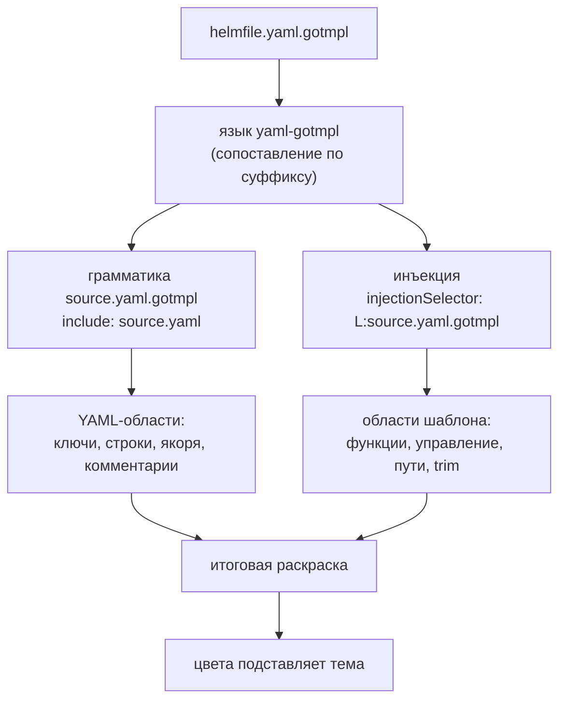

# Gotmpl YAML Highlighter - Plan

## Goal Capsule

- **Цель.** Расширение VS Code, которое подсвечивает `*.yaml.gotmpl` одновременно как YAML и как Go-шаблон, и даёт по шаблонным конструкциям hover, автодополнение и диагностику парности.
- **Кто решает по продукту.** Игорь Крамарь. Решения по цветовой модели, скоупу файлов, объёму справочника и языку подсказок приняты и зафиксированы в Key Decisions.
- **Открытые блокеры.** Публикация в VS Code Marketplace требует publisher-аккаунта Microsoft, которого пока нет. Блокирует только R13; разработка и локальная установка `.vsix` от него не зависят.

---

## Product Contract

### Summary

Расширение VS Code для файлов `*.yaml.gotmpl`, которое сохраняет YAML-подсветку и накладывает поверх неё разбор Go-шаблона, различая функции helmfile, функции sprig, управляющие конструкции, пути и trim-маркеры. Сверх раскраски даёт hover по конструкциям и функциям, автодополнение и подчёркивание незакрытых конструкций. Публикуется в Marketplace, все тексты на английском.

### Problem Frame

Файл `helmfile.yaml.gotmpl` — два языка в одном: YAML снаружи, Go-шаблон во вставках `{{ … }}`. VS Code выбирает один язык на файл, и все существующие расширения решают этот выбор одинаково — объявляют `.gotmpl` отдельным языком со своим scope. Следствие не в том, что раскраска плохая, а в том, что YAML пропадает целиком: ключи, якоря, списки, комментарии перестают отличаться друг от друга. Обратный выбор — оставить файл языком `yaml` — даёт зеркальную потерю: для YAML-грамматики `{{ requiredEnv "IMAGE_TAG" }}` неотличимо от произвольной строки.

Наблюдаемое сегодня хуже обоих вариантов. Установленное расширение `karyan40024.gotmpl-syntax-highlighter@0.0.3` объявляет расширения файлов как `["gotmpl", ".tmpl", ".tpl"]` — первый элемент без ведущей точки, чего VS Code не сопоставляет. То есть на `helmfile.yaml.gotmpl` не срабатывает ни оно, ни YAML: файл открывается как `plaintext`. Даже сработай оно, его грамматика содержит десять областей на весь язык, и все имена функций попадают в одну — `variable.other.readwrite`, — поэтому `requiredEnv` и `readFile` неразличимы по цвету принципиально.

Цена — на каждом чтении файлов деплоя: эталонный `helmfile.yaml.gotmpl` содержит несколько релизов, вложенные структуры и десятки строк комментариев, и всё это читается одним цветом.

### Key Decisions

- KD1. **Инъекционная грамматика поверх YAML, а не замена языка.** Единственный механизм VS Code, который накладывает вторую грамматику на существующую, не вытесняя её. Governs R1.
- KD2. **Собственный языковой идентификатор, инъекция целится в его scope, а не в `source.yaml`.** Инъекция в `source.yaml` подсветила бы `{{ }}` во всех YAML-файлах пользователя, включая Ansible и GitHub Actions, где такие последовательности имеют другой смысл. Плата: `redhat.vscode-yaml` не обслуживает эти файлы, поэтому редакторское поведение YAML обеспечивается своей конфигурацией языка. Governs R4, R12.
- KD3. **Цвета берёт активная тема; расширение своей палитры не задаёт** (session-settled: user-directed — выбрано над вариантом со своей палитрой поверх темы: расширение должно выглядеть родным на любой теме). Следствие принято осознанно: густота многоцветности становится свойством темы, а связывание парных `if`/`end` цветом и разбор пути по сегментам становятся недостижимы — грамматика TextMate не строит дерева. Governs R2, R3.
- KD4. **Языковые возможности — провайдеры в процессе расширения, без отдельного LSP-сервера.** Hover, автодополнение и диагностика для одного языка в одном редакторе не окупают процессной границы. Теряется переносимость на Neovim и другие LSP-клиенты. Governs R5, R6, R7, R9, R10.
- KD5. **Справочник функций генерируется скриптом из документации, а не набивается руками** (session-settled: user-directed — выбрано над ходовым подмножеством: полнота при неизменной ручной работе). Ручная набивка двухсот функций устарела бы к первому релизу sprig. Governs R8.
- KD6. **Все тексты расширения на английском** (session-settled: user-directed — выбрано над двуязычным переключателем: расширение публикуется в Marketplace). Governs R8.
- KD7. **Скоуп ограничен `*.yaml.gotmpl`** (session-settled: user-directed — выбрано над любыми `.gotmpl`: в рабочих проектах файлы только этой формы). Ограничение вдобавок обходит известный потолок механизма: инъекция не каскадится внутрь уже встроенного языка, поэтому диспетчеризация базовой грамматики по вложенному расширению потребовала бы другого решения. Governs R4.

### Как устроена раскраска

Инъекция целится в собственный scope, а не в `source.yaml` — поэтому шаблонные области появляются во всех местах файла, включая внутренности YAML-строк, но не появляются в чужих YAML-файлах.

### Requirements

**Подсветка**

- R1. Файл `*.yaml.gotmpl` подсвечивается одновременно как YAML и как Go-шаблон: YAML-области (ключи, строки, числа, якоря, комментарии, маркеры списков и блочных скаляров) сохраняются, шаблонные вставки получают собственные области.
- R2. Грамматика различает отдельными областями: ограничители `{{` и `}}`, trim-маркеры `{{-` и `-}}`, управляющие конструкции (`if`, `else`, `else if`, `range`, `with`, `end`, `define`, `template`, `block`), функции helmfile, функции sprig, строковые литералы, числа, `true`/`false`/`nil`, переменные вида `$name`, пути вида `.Values.foo`, оператор конвейера `|`, оператор присваивания `:=`, комментарии шаблона `{{/* … */}}`.
- R3. Расширение не задаёт цвета: раскраску областей выполняет активная тема пользователя.
- R4. Подсветка шаблона применяется только к файлам с суффиксом `.yaml.gotmpl`; открытый рядом обычный `.yaml` не меняет вида, включая файлы с последовательностями `{{ }}` и `${{ }}`.

**Подсказки**

- R5. Наведение на управляющую конструкцию показывает описание того, что она делает, и пример применения.
- R6. Наведение на имя функции показывает её сигнатуру, описание и пример.
- R7. Автодополнение внутри `{{ }}` предлагает имена функций и сниппеты парных конструкций (`if`…`end`, `range`…`end`, `with`…`end`) с описанием в списке.
- R8. Справочник покрывает все функции sprig и все функции helmfile, тексты на английском, содержимое порождается скриптом из внешней документации и хранится в репозитории как сгенерированный артефакт.

**Диагностика**

- R9. Незакрытая вставка (`{{` без `}}`) подчёркивается как ошибка с указанием позиции открытия.
- R10. Непарные конструкции подчёркиваются как ошибка: открывающая без `end`, лишний `end`, `else` вне `if`/`with`.
- R11. На корректном файле диагностика молчит: проверяется на эталонном `helmfile.yaml.gotmpl` и на тестовом корпусе, включающем `{{` внутри YAML-строк, внутри комментариев YAML и внутри блочных скаляров.

**Редакторское поведение**

- R12. Комментирование строки, автоотступ, свёртка по отступам и подсветка парных скобок работают в этих файлах так же, как в YAML.

**Поставка**

- R13. Расширение опубликовано в VS Code Marketplace и устанавливается поиском по названию.
- R14. README показывает снимок экрана «до и после» на реальном фрагменте helmfile и перечисляет, что расширение делает и чего не делает.

### Acceptance Examples

- AE1. **Covers R1, R2.** **Given** открыт эталонный `helmfile.yaml.gotmpl`. **When** пользователь смотрит на строку `username: {{ requiredEnv "HelmRegistryUsername" }}`. **Then** `username` окрашен как YAML-ключ, `requiredEnv` — как функция helmfile, строка в кавычках — как строка, `{{` и `}}` — как ограничители, и все четыре цвета различны.
- AE2. **Covers R4.** **Given** в редакторе открыты `helmfile.yaml.gotmpl` и `.github/workflows/ci.yaml`, содержащий `${{ github.sha }}`. **When** пользователь переключается между вкладками. **Then** в первом файле шаблонные области подсвечены, во втором вид не отличается от вида без установленного расширения.
- AE3. **Covers R10.** **Given** файл содержит `{{ if .Values.debug }}` без соответствующего `{{ end }}`. **When** файл открыт или изменён. **Then** конструкция `if` подчёркнута как ошибка с сообщением о недостающем `end`, а прочие конструкции файла не подчёркнуты.
- AE4. **Covers R11.** **Given** файл содержит YAML-строку `description: "используйте {{ для вставки"` и комментарий `# {{ end }} в комментарии`. **When** файл открыт. **Then** диагностика не выдаёт ошибок ни по одной из этих строк.
- AE5. **Covers R6.** **Given** курсор наведён на `indent` в выражении `{{ readFile "x.conf" | indent 16 }}`. **When** появляется всплывающая подсказка. **Then** она содержит сигнатуру функции, описание и пример, и относится к `indent`, а не к `readFile`.

### Scope Boundaries

- Шаблоны поверх не-YAML: `.json.gotmpl`, `.conf.gotmpl`, `.tpl`, `.tmpl` — вне скоупа.
- Шаблоны Helm-чартов (`templates/*.yaml` без суффикса `.gotmpl`) — вне скоупа: они опознаются не расширением, а положением в чарте, и требуют другой эвристики.
- Форматирование файла и выполнение шаблона (подстановка значений, предпросмотр результата) — вне скоупа: расширение только читает.
- Разрешение путей `.Values.*` по фактическому `values.yaml` — вне скоупа; этим занимается `tim-koehler.helm-intellisense` для чартов.
- Собственная цветовая тема в комплекте — вне скоупа по KD3.

### Dependencies / Assumptions

- Публикация в Marketplace требует publisher-аккаунта Microsoft — его получение вне контроля разработки.
- Предполагается, что инъекция с селектором на собственный scope применяется внутри правил включённой грамматики YAML. Это следует из устройства инъекций, но проверяется на первом же работающем прототипе; если предположение неверно, KD2 пересматривается, а R4 достигается иначе.
- Предполагается, что документация sprig пригодна к машинному разбору со стабильной структурой. Если структура непригодна, генератор берёт исходники sprig вместо документации; на R8 это не влияет.
- Эталонный `helmfile.yaml.gotmpl` содержит только `requiredEnv` и `readFile | indent` — ни одной управляющей конструкции. Для проверки R2, R9, R10, R11 нужен отдельный тестовый корпус, эталонного файла недостаточно.

### Outstanding Questions

**Resolve Before Planning**

- Publisher-аккаунт Microsoft для публикации: есть ли он, кто его заводит. Блокирует R13, не блокирует остальное.

**Deferred to Planning**

- Источник описаний функций sprig: документация проекта против исходников с комментариями.
- Форма хранения справочника и способ его обновления при выходе новой версии sprig.
- Нужен ли отдельный языковой идентификатор для `helmfile.yaml.gotmpl` или достаточно общего для всех `*.yaml.gotmpl`.

### Sources / Research

- Эталонный `helmfile.yaml.gotmpl` из рабочего проекта — 272 строки, пять шаблонных вставок, обширные комментарии. В репозиторий расширения не входит; тестовый корпус пишется отдельно.
- Установленное окружение: `karyan40024.gotmpl-syntax-highlighter@0.0.3`, `redhat.vscode-yaml@1.24.0`, `tim-koehler.helm-intellisense@0.15.0`, активная тема `enkia.tokyo-night@1.1.2`.
- Ограничение механизма инъекций: инъекция не применяется внутрь уже встроенного языка и не каскадится в другую инъекцию (microsoft/vscode-textmate, issues #122 и #152). Определяет границу скоупа по KD7.
- Существующие расширения того же назначения: `romantomjak/vscode-go-template`, `jinliming2/vscode-go-template`, `mortenson/go-template-transpiler-extension` — все объявляют отдельный язык, ни одно не сохраняет базовую грамматику.
