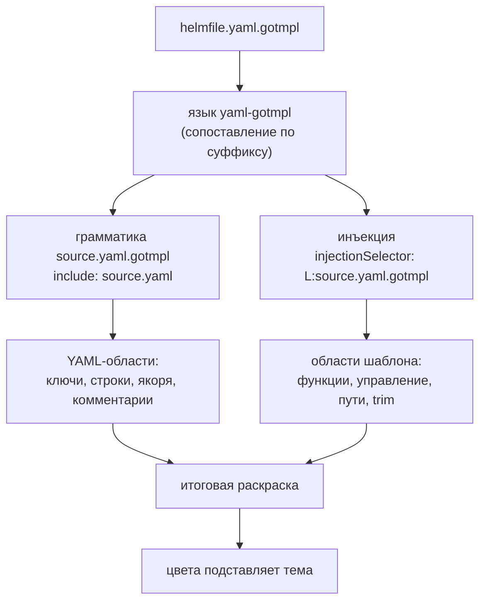

# Gotmpl YAML Highlighter - Plan

## Goal Capsule

- **Цель.** Расширение VS Code, которое подсвечивает `*.yaml.gotmpl` одновременно как YAML и как Go-шаблон, и даёт по шаблонным конструкциям hover, автодополнение и диагностику парности.
- **Кто решает по продукту.** Игорь Крамарь. Решения по цветовой модели, скоупу файлов, объёму справочника и языку подсказок приняты и зафиксированы в Key Decisions.
- **Открытые блокеры.** Публикация в VS Code Marketplace требует publisher-аккаунта Microsoft, которого пока нет. Блокирует только R13; разработка и локальная установка `.vsix` от него не зависят.
- **Что спланировано на этот срез.** Implementation Units ниже покрывают R1-R4 и R12 — подсветку, изоляцию от чужих YAML и редакторское поведение. Требования R5-R11 (подсказки, диагностика) и R13, R14 (поставка) остаются без юнитов до своих задач; план дополняется по мере их взятия.
- **Продуктовый контракт не менялся.** Requirements, Key Decisions и Acceptance Examples сохранены дословно, R-ID не переприсваивались.

---

## Product Contract

### Summary

Расширение VS Code для файлов `*.yaml.gotmpl`, которое сохраняет YAML-подсветку и накладывает поверх неё разбор Go-шаблона, различая функции helmfile, функции sprig, управляющие конструкции, пути и trim-маркеры. Сверх раскраски даёт hover по конструкциям и функциям, автодополнение и подчёркивание незакрытых конструкций. Публикуется в Marketplace, все тексты на английском.

### Problem Frame

Файл `helmfile.yaml.gotmpl` — два языка в одном: YAML снаружи, Go-шаблон во вставках `{{ … }}`. VS Code выбирает один язык на файл, и все существующие расширения решают этот выбор одинаково — объявляют `.gotmpl` отдельным языком со своим scope. Следствие не в том, что раскраска плохая, а в том, что YAML пропадает целиком: ключи, якоря, списки, комментарии перестают отличаться друг от друга. Обратный выбор — оставить файл языком `yaml` — даёт зеркальную потерю: для YAML-грамматики `{{ requiredEnv "IMAGE_TAG" }}` неотличимо от произвольной строки.

Наблюдаемое сегодня хуже обоих вариантов. Установленное расширение `karyan40024.gotmpl-syntax-highlighter@0.0.3` объявляет расширения файлов как `["gotmpl", ".tmpl", ".tpl"]` — первый элемент без ведущей точки, чего VS Code не сопоставляет. То есть на `helmfile.yaml.gotmpl` не срабатывает ни оно, ни YAML: файл открывается как `plaintext`. Даже сработай оно, его грамматика содержит десять областей на весь язык, и все имена функций попадают в одну — `variable.other.readwrite`, — поэтому `requiredEnv` и `readFile` неразличимы по цвету принципиально.

Цена — на каждом чтении файлов деплоя: эталонный `helmfile.yaml.gotmpl` содержит несколько релизов, вложенные структуры и десятки строк комментариев, и всё это читается одним цветом.

### Key Decisions

- KD1. **Инъекционная грамматика поверх YAML, а не замена языка.** Единственный механизм VS Code, который накладывает вторую грамматику на существующую, не вытесняя её. Governs R1.
- KD2. **Собственный языковой идентификатор, инъекция целится в его scope, а не в `source.yaml`.** Инъекция в `source.yaml` подсветила бы `{{ }}` во всех YAML-файлах пользователя, включая Ansible и GitHub Actions, где такие последовательности имеют другой смысл. Плата: `redhat.vscode-yaml` не обслуживает эти файлы, поэтому редакторское поведение YAML обеспечивается своей конфигурацией языка. Governs R4, R12.
- KD3. **Цвета берёт активная тема; расширение своей палитры не задаёт** (session-settled: user-directed — выбрано над вариантом со своей палитрой поверх темы: расширение должно выглядеть родным на любой теме). Следствие принято осознанно: густота многоцветности становится свойством темы, а связывание парных `if`/`end` цветом и разбор пути по сегментам становятся недостижимы — грамматика TextMate не строит дерева. Governs R2, R3.
- KD4. **Языковые возможности — провайдеры в процессе расширения, без отдельного LSP-сервера.** Hover, автодополнение и диагностика для одного языка в одном редакторе не окупают процессной границы. Теряется переносимость на Neovim и другие LSP-клиенты. Governs R5, R6, R7, R9, R10.
- KD5. **Справочник функций генерируется скриптом из документации, а не набивается руками** (session-settled: user-directed — выбрано над ходовым подмножеством: полнота при неизменной ручной работе). Ручная набивка двухсот функций устарела бы к первому релизу sprig. Governs R8.
- KD6. **Все тексты расширения на английском** (session-settled: user-directed — выбрано над двуязычным переключателем: расширение публикуется в Marketplace). Governs R8.
- KD7. **Скоуп ограничен `*.yaml.gotmpl`** (session-settled: user-directed — выбрано над любыми `.gotmpl`: в рабочих проектах файлы только этой формы). Ограничение вдобавок обходит известный потолок механизма: инъекция не каскадится внутрь уже встроенного языка, поэтому диспетчеризация базовой грамматики по вложенному расширению потребовала бы другого решения. Governs R4.

### Как устроена раскраска

Инъекция целится в собственный scope, а не в `source.yaml` — поэтому шаблонные области появляются во всех местах файла, включая внутренности YAML-строк, но не появляются в чужих YAML-файлах.

### Requirements

**Подсветка**

- R1. Файл `*.yaml.gotmpl` подсвечивается одновременно как YAML и как Go-шаблон: YAML-области (ключи, строки, числа, якоря, комментарии, маркеры списков и блочных скаляров) сохраняются, шаблонные вставки получают собственные области.
- R2. Грамматика различает отдельными областями: ограничители `{{` и `}}`, trim-маркеры `{{-` и `-}}`, управляющие конструкции (`if`, `else`, `else if`, `range`, `with`, `end`, `define`, `template`, `block`), функции helmfile, функции sprig, строковые литералы, числа, `true`/`false`/`nil`, переменные вида `$name`, пути вида `.Values.foo`, оператор конвейера `|`, оператор присваивания `:=`, комментарии шаблона `{{/* … */}}`.
- R3. Расширение не задаёт цвета: раскраску областей выполняет активная тема пользователя.
- R4. Подсветка шаблона применяется только к файлам с суффиксом `.yaml.gotmpl`; открытый рядом обычный `.yaml` не меняет вида, включая файлы с последовательностями `{{ }}` и `${{ }}`.

**Подсказки**

- R5. Наведение на управляющую конструкцию показывает описание того, что она делает, и пример применения.
- R6. Наведение на имя функции показывает её сигнатуру, описание и пример.
- R7. Автодополнение внутри `{{ }}` предлагает имена функций и сниппеты парных конструкций (`if`…`end`, `range`…`end`, `with`…`end`) с описанием в списке.
- R8. Справочник покрывает все функции sprig и все функции helmfile, тексты на английском, содержимое порождается скриптом из внешней документации и хранится в репозитории как сгенерированный артефакт.

**Диагностика**

- R9. Незакрытая вставка (`{{` без `}}`) подчёркивается как ошибка с указанием позиции открытия.
- R10. Непарные конструкции подчёркиваются как ошибка: открывающая без `end`, лишний `end`, `else` вне `if`/`with`.
- R11. На корректном файле диагностика молчит: проверяется на эталонном `helmfile.yaml.gotmpl` и на тестовом корпусе, включающем `{{` внутри YAML-строк, внутри комментариев YAML и внутри блочных скаляров.

**Редакторское поведение**

- R12. Комментирование строки, автоотступ, свёртка по отступам и подсветка парных скобок работают в этих файлах так же, как в YAML.

**Поставка**

- R13. Расширение опубликовано в VS Code Marketplace и устанавливается поиском по названию.
- R14. README показывает снимок экрана «до и после» на реальном фрагменте helmfile и перечисляет, что расширение делает и чего не делает.

### Acceptance Examples

- AE1. **Covers R1, R2.** **Given** открыт эталонный `helmfile.yaml.gotmpl`. **When** пользователь смотрит на строку `username: {{ requiredEnv "HelmRegistryUsername" }}`. **Then** `username` окрашен как YAML-ключ, `requiredEnv` — как функция helmfile, строка в кавычках — как строка, `{{` и `}}` — как ограничители, и все четыре цвета различны.
- AE2. **Covers R4.** **Given** в редакторе открыты `helmfile.yaml.gotmpl` и `.github/workflows/ci.yaml`, содержащий `${{ github.sha }}`. **When** пользователь переключается между вкладками. **Then** в первом файле шаблонные области подсвечены, во втором вид не отличается от вида без установленного расширения.
- AE3. **Covers R10.** **Given** файл содержит `{{ if .Values.debug }}` без соответствующего `{{ end }}`. **When** файл открыт или изменён. **Then** конструкция `if` подчёркнута как ошибка с сообщением о недостающем `end`, а прочие конструкции файла не подчёркнуты.
- AE4. **Covers R11.** **Given** файл содержит YAML-строку `description: "используйте {{ для вставки"` и комментарий `# {{ end }} в комментарии`. **When** файл открыт. **Then** диагностика не выдаёт ошибок ни по одной из этих строк.
- AE5. **Covers R6.** **Given** курсор наведён на `indent` в выражении `{{ readFile "x.conf" | indent 16 }}`. **When** появляется всплывающая подсказка. **Then** она содержит сигнатуру функции, описание и пример, и относится к `indent`, а не к `readFile`.

### Scope Boundaries

- Шаблоны поверх не-YAML: `.json.gotmpl`, `.conf.gotmpl`, `.tpl`, `.tmpl` — вне скоупа.
- Шаблоны Helm-чартов (`templates/*.yaml` без суффикса `.gotmpl`) — вне скоупа: они опознаются не расширением, а положением в чарте, и требуют другой эвристики.
- Форматирование файла и выполнение шаблона (подстановка значений, предпросмотр результата) — вне скоупа: расширение только читает.
- Разрешение путей `.Values.*` по фактическому `values.yaml` — вне скоупа; этим занимается `tim-koehler.helm-intellisense` для чартов.
- Собственная цветовая тема в комплекте — вне скоупа по KD3.

### Dependencies / Assumptions

- Публикация в Marketplace требует publisher-аккаунта Microsoft — его получение вне контроля разработки.
- Предполагается, что инъекция с селектором на собственный scope применяется внутри правил включённой грамматики YAML. Риск выше, чем кажется: встроенная грамматика YAML сама подключает `source.yaml.1.2` через `include`, то есть попадает ровно в тот случай, про который известное ограничение и написано. Предположение проверяется первым же юнитом реализации. Провал на верхнем уровне обрушивает подход целиком и означает остановку с докладом; провал только внутри YAML-строк и блочных скаляров — не остановка, а граница возможностей, которая фиксируется в README. Переход на инъекцию в `source.yaml` обходным путём не является: он нарушает R4.
- Предполагается, что документация sprig пригодна к машинному разбору со стабильной структурой. Если структура непригодна, генератор берёт исходники sprig вместо документации; на R8 это не влияет.
- Эталонный `helmfile.yaml.gotmpl` содержит только `requiredEnv` и `readFile | indent` — ни одной управляющей конструкции. Для проверки R2, R9, R10, R11 нужен отдельный тестовый корпус, эталонного файла недостаточно.

### Outstanding Questions

**Resolve Before Planning**

- Publisher-аккаунт Microsoft для публикации: есть ли он, кто его заводит. Блокирует R13, не блокирует остальное.

**Deferred to Planning**

- Источник описаний функций sprig: документация проекта против исходников с комментариями.
- Форма хранения справочника и способ его обновления при выходе новой версии sprig.

### Sources / Research

- Эталонный `helmfile.yaml.gotmpl` из рабочего проекта — 272 строки, пять шаблонных вставок, обширные комментарии. В репозиторий расширения не входит; тестовый корпус пишется отдельно.
- Установленное окружение: `karyan40024.gotmpl-syntax-highlighter@0.0.3`, `redhat.vscode-yaml@1.24.0`, `tim-koehler.helm-intellisense@0.15.0`, активная тема `enkia.tokyo-night@1.1.2`.
- Ограничение механизма инъекций: инъекция не применяется внутрь уже встроенного языка и не каскадится в другую инъекцию (microsoft/vscode-textmate, issues #122 и #152). Определяет границу скоупа по KD7 и одновременно является главным техническим риском подхода — см. Assumptions.
- Устройство встроенной грамматики YAML (проверено на VS Code 1.134.0): `source.yaml` — тонкий диспетчер, включающий `source.yaml.1.2` по умолчанию и `source.yaml.embedded` для встраивания; версии 1.0, 1.1 и 1.3 лежат отдельными файлами. Происхождение — RedCMD/YAML-Syntax-Highlighter, лицензия MIT.
- Существующие расширения того же назначения: `romantomjak/vscode-go-template`, `jinliming2/vscode-go-template`, `mortenson/go-template-transpiler-extension` — все объявляют отдельный язык, ни одно не сохраняет базовую грамматику.

---

## Planning Contract

### Key Technical Decisions

- KTD1. **Проба механизма отдельным ранним юнитом, до написания полной грамматики.** Подход целиком стоит на предположении, которое ни документацией, ни чужим опытом не подтверждено: применяется ли инъекция с селектором на корневой scope внутри правил грамматики, подключённой через `include`. Известное ограничение библиотеки прямо про это (microsoft/vscode-textmate #122, #152). Узнать ответ надо ценой одной минимальной грамматики, а не полной. Governs R1, R4. Реализует KD2.
- KTD2. **Проверка токенизации прогоняется вне редактора через `vscode-textmate` + `vscode-oniguruma`.** Это тот же движок, что и в редакторе, поэтому расхождения между тестом и реальностью не будет. Альтернатива — открывать файл руками и смотреть глазами — не даёт регрессии и не переживает правку грамматики. Governs R2.
- KTD3. **YAML-грамматика для тестов копируется скриптом из локальной установки VS Code, а не вендорится в репозиторий.** Встроенная грамматика — цепочка из шести файлов (`source.yaml` — тонкий диспетчер, включающий `source.yaml.1.2` по умолчанию и `source.yaml.embedded` для встраивания), она версионируется вместе с редактором и обновляется без нас. Копия в репозитории протухла бы молча. Лицензия источника (RedCMD/YAML-Syntax-Highlighter) — MIT, то есть вендоринг допустим и остаётся запасным путём, если копирование окажется ненадёжным на чужой машине.
- KTD4. **Инъекция описывается отдельным файлом грамматики, а не встраивается в основную.** Разделение повторяет то, как это устроено в самом VS Code, и оставляет основную грамматику тривиальной: одна строка `include`. Отладка тоже проще — видно, какой из двух слоёв дал область.
- KTD5. **Регистрация языка через `filenamePatterns`, а не `extensions`.** VS Code сопоставляет `extensions` по последнему суффиксу, поэтому `.gotmpl` захватил бы и `.json.gotmpl`, и `.conf.gotmpl` — прямое нарушение KD7. Шаблон `*.yaml.gotmpl` выражает границу скоупа буквально. Governs R4. Реализует KD7.

### Assumptions

- Инъекция с селектором `L:source.yaml.gotmpl` применяется внутри правил включённой грамматики YAML. Это предположение, а не факт; U2 его проверяет и является гейтом для остальных юнитов.
- Локальная установка VS Code присутствует на машине разработчика и содержит встроенную грамматику YAML. Проверено на этой машине: VS Code 1.134.0, `/usr/share/code/resources/app/extensions/yaml/syntaxes/`. На других платформах путь другой — скрипт ищет по нескольким известным местам и внятно падает, если не нашёл.
- `redhat.vscode-yaml` регистрирует ту же область `source.yaml`, что и встроенная грамматика. На собственный scope расширения это не влияет, но при отладке различие важно помнить.

### Sequencing

U1 → **U2 (гейт)** → U3 → U4 → U5 → U6. U2 останавливает всё остальное: пока механизм не подтверждён, писать полную грамматику незачем. U5 может начинаться параллельно U3, но завершается после него.

---

## Implementation Units

### U1. Скелет расширения

- **Goal.** Собираемое и устанавливаемое расширение VS Code без единой языковой возможности — точка, от которой можно проверять всё остальное.
- **Requirements.** Предпосылка для R1-R4, R12.
- **Dependencies.** Нет.
- **Files.** `package.json`, `tsconfig.json`, `.vscodeignore`, `eslint.config.mjs`, `src/extension.ts`.
- **Approach.**
  1. `package.json` с полями издателя, `engines.vscode`, категориями и пустым `contributes`. Тексты английские.
  2. TypeScript со сборкой в `out/`, точка входа `src/extension.ts` с пустыми `activate`/`deactivate`.
  3. Линт минимальной конфигурацией, без правил «на будущее».
  4. `.vscodeignore` исключает исходники, тесты и `docs/` из пакета.
- **Patterns to follow.** Стандартный скелет расширения VS Code; никаких зависимостей сверх `@types/vscode`, `typescript`, `eslint`.
- **Test scenarios.** `Test expectation: none` — юнит не несёт поведения: только сборка и упаковка. Проверка выражена в Verification ниже.
- **Verification.** Сборка проходит без ошибок; линт чистый; `npx @vscode/vsce package` выдаёт `.vsix`. Аккаунт издателя для упаковки не нужен — достаточно заполненного поля `publisher`; аккаунт требуется только для публикации (R13, другая задача).

### U2. Проба механизма инъекции — гейт

- **Goal.** Ответить фактом, а не рассуждением, на вопрос: применяется ли инъекция с селектором на корневой scope внутри правил включённой грамматики YAML, и в каких именно контекстах.
- **Requirements.** Governs R1, R4; проверяет KD2, KTD1.
- **Dependencies.** U1.
- **Files.** `syntaxes/yaml-gotmpl.tmLanguage.json`, `syntaxes/gotmpl-injection.tmLanguage.json`, `scripts/fetch-yaml-grammar.mjs`, `test/tokenize.mjs`, `test/fixtures/probe.yaml.gotmpl`.
- **Approach.**
  1. Скрипт `fetch-yaml-grammar.mjs` ищет каталог встроенных грамматик YAML в известных местах установки VS Code (`/usr/share/code/resources/app/extensions/yaml/syntaxes`, `/usr/lib/code/...`, пути macOS и Windows) и копирует всю цепочку в игнорируемый git каталог. Не нашёл — внятная ошибка с перечислением проверенных путей, а не молчаливый пропуск.
  2. Основная грамматика: `scopeName: source.yaml.gotmpl`, `patterns: [{"include": "source.yaml"}]` — больше ничего.
  3. Инъекционная грамматика: минимальная, одно правило на `{{ … }}` с областью `punctuation.section.embedded`, `injectionSelector: "L:source.yaml.gotmpl"`.
  4. `test/tokenize.mjs` собирает `Registry` из `vscode-textmate` с `onigLib` из `vscode-oniguruma`, отдаёт грамматики через `loadGrammar` и — существенно — объявляет инъекцию через `getInjections(scopeName)`: именно так редактор подключает инъекции, и без этого проба проверила бы не то.
  5. Пробный образец содержит три контекста: `{{ }}` в значении ключа на верхнем уровне; `{{ }}` внутри строки в двойных кавычках; `{{ }}` внутри блочного скаляра `|`.
- **Execution note.** Начать с пробы, а не со скелета грамматики: цель юнита — знание, а не код. Результат по каждому из трёх контекстов зафиксировать письменно.
- **Test scenarios.**
  1. Токенизация пробного образца завершается без исключения и возвращает непустой список токенов.
  2. `{{ requiredEnv "X" }}` в значении ключа верхнего уровня несёт область инъекции.
  3. То же внутри строки в двойных кавычках — фиксируется результат, каким бы он ни был.
  4. То же внутри блочного скаляра `|` — фиксируется результат.
  5. YAML-области (`entity.name.tag` на ключе) присутствуют одновременно с областями инъекции — то есть включение `source.yaml` работает.
- **Verification.** Написан отчёт: подсвечивается / не подсвечивается по каждому из трёх контекстов, с той же градацией, что в Assumptions продуктового контракта. **Гейт: провал в контексте 1 (верхний уровень) — остановиться и доложить.** Провал только в контекстах 2 и 3 — граница возможностей: фиксируется, попадает в README, работа продолжается. Переключение инъекции на `source.yaml` запрещено при любом исходе — оно нарушит R4.

### U3. Полная грамматика Go-шаблона

- **Goal.** Инъекционная грамматика различает все сущности, перечисленные в R2, общепринятыми областями TextMate.
- **Requirements.** Covers R2, R3.
- **Dependencies.** U2 (гейт пройден).
- **Files.** `syntaxes/gotmpl-injection.tmLanguage.json`, `test/fixtures/constructs.yaml.gotmpl`.
- **Approach.**
  1. Внешнее правило: от `{{` или `{{-` до `}}` или `-}}`, область `meta.embedded.block.gotmpl`, ограничители — `punctuation.section.embedded`.
  2. Внутри: комментарий шаблона `{{/* … */}}` отдельным правилом раньше остальных, иначе его содержимое разберётся как код.
  3. Управляющие слова — `keyword.control`; функции helmfile — `support.function` (перечислимый список); функции sprig — `entity.name.function` (сопоставление по форме идентификатора, а не по списку: полный перечень появится в GTM-2 и здесь не нужен).
  4. Строки — `string.quoted.double` и `string.quoted.single`; числа — `constant.numeric`; `true`/`false`/`nil` — `constant.language`; `$name` — `variable.other`; пути `.Foo.Bar` — `variable.other.member`; `|` и `:=` — `keyword.operator`.
  5. Различение helmfile и sprig по списку имён — единственное место, где грамматика знает предметную область; список держать в одном месте файла и коротко это отметить. Правило helmfile обязано стоять раньше правила sprig: sprig сопоставляется по форме идентификатора и иначе поглотит `requiredEnv` первым.
- **Patterns to follow.** Имена областей брать ровно те, что темы действительно красят: сверяться с тем, какие правила есть в теме Tokyo Night, а не изобретать `*.gotmpl`-суффиксы, на которые не подписана ни одна тема.
- **Test scenarios.**
  1. Каждая сущность из R2 встречается в образце хотя бы раз и получает ожидаемую область — по позиции, а не по факту наличия где-то в файле.
  2. `{{- if … }}` — trim-маркер отделён от ключевого слова и несёт свою область.
  3. `{{/* комментарий с {{ внутри */}}` целиком является комментарием; вложенная последовательность не открывает новую вставку.
  4. `{{ readFile "x" | indent 16 }}` — `readFile` как функция helmfile, `indent` как функция sprig, `|` как оператор, `16` как число, строка как строка: пять разных областей в одном выражении.
  5. Отсутствие области `*.gotmpl`-суффикса там, где тема её не покрасит: проверяется, что использованы общепринятые имена.
- **Verification.** Все сценарии проходят; ни одно правило не задаёт цвет (R3 — в расширении нет `configurationDefaults` с цветами и нет темы).

### U4. Конфигурация языка

- **Goal.** Редакторское поведение в этих файлах не хуже, чем в YAML.
- **Requirements.** Covers R12.
- **Dependencies.** U1.
- **Files.** `language-configuration.json`, `package.json`.
- **Approach.** Взять за образец конфигурацию языка встроенного YAML-расширения: комментарии `#`, пары скобок, автозакрытие кавычек, правила отступа, свёртка по отступам. Отличия от образца — только если они обоснованы шаблонными вставками.
- **Test scenarios.** `Test expectation: none` — поведение обеспечивается декларацией и проверяется вручную в редакторе; программной проверки конфигурации языка вне редактора не существует.
- **Verification.** В открытом `.yaml.gotmpl`: комментирование строки даёт `#`; Enter после ключа с двоеточием увеличивает отступ; блоки сворачиваются; парная скобка подсвечивается.

### U5. Тестовый корпус и проверка токенизации

- **Goal.** Регрессия, которая падает при поломке грамматики, а не просто существует.
- **Requirements.** Covers R2, R11 (в части «диагностика молчит» — здесь проверяется корректность разбора, сама диагностика придёт в GTM-4).
- **Dependencies.** U2; завершается после U3.
- **Files.** `test/tokenize.mjs`, `test/grammar.test.mjs`, `test/fixtures/*.yaml.gotmpl`.
- **Approach.**
  1. Вынести из `test/tokenize.mjs` пригодный к переиспользованию помощник: «дай области в позиции (строка, столбец)».
  2. Корпус: конструкции (U3), вставки внутри строк в кавычках, вставки внутри блочных скаляров `|` и `>`, `{{` внутри комментария YAML, вложенные `if`/`range`, файл без единой вставки (чистый YAML).
  3. Утверждения писать по смыслу — «в этой позиции есть область функции», — а не сверкой полного списка областей: последнее ломается от любой правки грамматики и обесценивает тест.
  4. Прогон одной командой, встроенной в `package.json`.
- **Test scenarios.**
  1. Файл без вставок токенизируется как обычный YAML; областей инъекции нет ни в одной позиции.
  2. `{{` внутри комментария YAML не открывает вставку.
  3. Вложенные `if` внутри `range` — оба ключевых слова получают область управления.
  4. Блочный скаляр `>` ведёт себя так же, как `|` (результат фиксируется по итогам U2).
  5. Прогон падает, если из грамматики убрать любое правило R2 — проверяется мутацией на одном правиле, чтобы убедиться, что тест вообще способен упасть.
- **Verification.** Одна команда прогоняет весь корпус; мутация правила роняет прогон.

### U6. Изоляция от чужих YAML

- **Goal.** Доказать R4: расширение не трогает обычные YAML-файлы.
- **Requirements.** Covers R4.
- **Dependencies.** U3.
- **Files.** `test/fixtures/plain.yaml`, `test/fixtures/workflow.yaml`, `test/grammar.test.mjs`.
- **Approach.** Токенизировать образцы грамматикой `source.yaml` (без нашей основной), при том же реестре, где инъекция объявлена. Если инъекция протекает, области шаблона появятся и там — тест это увидит. Образцы: обычный YAML с `{{ }}` в стиле Ansible и файл GitHub Actions с `${{ }}`.

  Существенная ловушка: `getInjections` в тестовой проводке обязан возвращать инъекцию **для любого запрошенного scope**, отдавая отсев селектору самой библиотеки. Если проводка не вернёт инъекцию для `source.yaml`, тест пройдёт, ничего не проверив, — он подтвердит собственную настройку вместо поведения редактора.
- **Test scenarios.**
  1. `{{ ansible_var }}` в файле, токенизированном как `source.yaml`, не получает ни одной области инъекции.
  2. `${{ github.sha }}` — то же самое.
  3. Тот же текст в файле `.yaml.gotmpl` области инъекции получает — то есть тест различает изоляцию и неработающую грамматику.
- **Verification.** Все три сценария проходят. Третий обязателен: без него первые два проходили бы и на сломанной грамматике.

---

## Verification Contract

| Гейт | Команда | Область | Признак прохождения |
| --- | --- | --- | --- |
| Сборка | `npm run compile` | U1-U6 | Завершается без ошибок TypeScript |
| Линт | `npm run lint` | U1-U6 | Ни одной ошибки |
| Грамматика | `npm test` | U2, U3, U5, U6 | Все сценарии токенизации проходят |
| Упаковка | `npx @vscode/vsce package` | U1 | Создаётся `.vsix` |
| Редактор | вручную: открыть `.yaml.gotmpl` | U4 | Комментирование, отступ, свёртка, парные скобки работают |

Пайплайна CI у проекта нет, и эта задача его не заводит: завершение GTM-1 определяется мержем PR, а не прохождением пайплайна.

---

## Definition of Done

- U1-U6 реализованы; `npm test`, `npm run lint`, `npm run compile` проходят.
- Гейт U2 пройден и его результат записан по всем трём контекстам — включая случай, когда инъекция внутрь строк или блочных скаляров не проникает: это фиксируется как граница, а не замалчивается.
- R1, R2, R3, R4, R12 выполнены; AE1 и AE2 из Acceptance Examples воспроизводятся.
- Расширение не задаёт ни одного цвета.
- В коде, коммитах, README и описании PR нет упоминаний ассистента, ИИ и соавторства.
- PR открыт на `main` и влит; локально устанавливаемый `.vsix` собирается.
